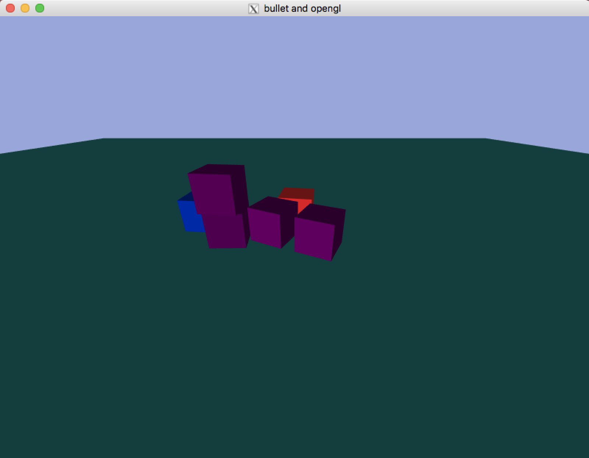
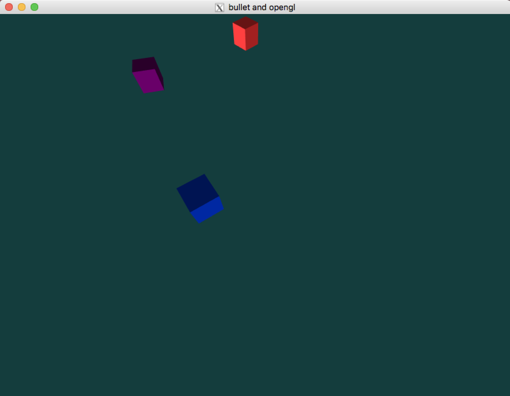
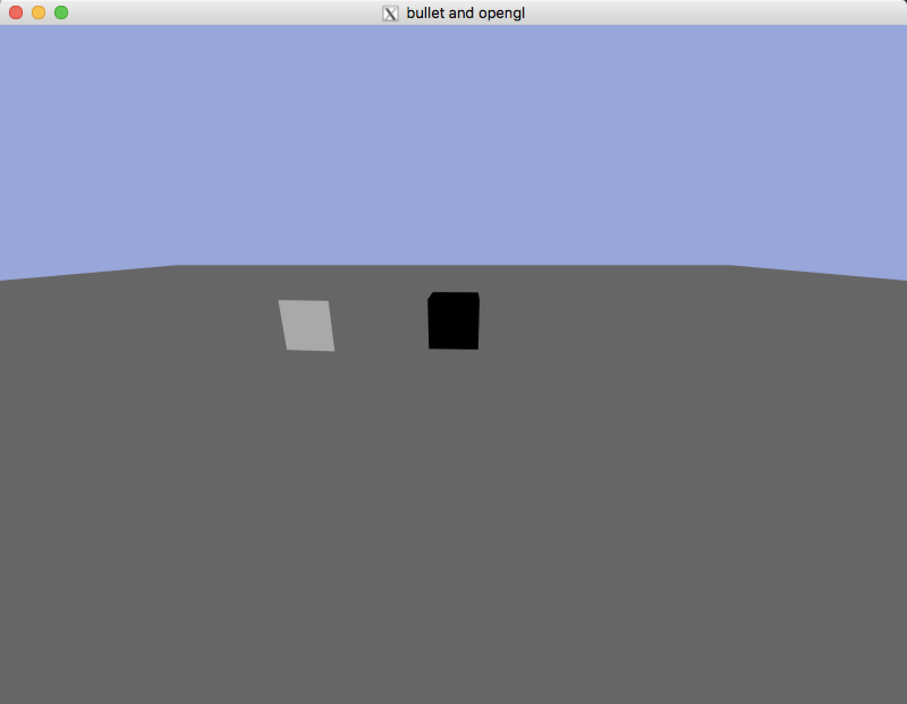

# bulletOpenGL
learning game physics with bullet physics and opengl

# Screenshots

## CH1.2 The Application Layer

## CH2.1 Rendering The Scene

## CH2.2 Basic Rendering And Lighting

## CH2.3 User Input And Camera Control

> USE `up` `down` `left` `right` to move and USE `Z` `X` to zoom 

## CH3.2 Createing Our First Physics Object

## CH4.1 Handing Multiple Objects

## CH4.2 Debug Drawer

> use `W` to toggle wireframe debug drawing, use `B` to toggle AABB debug drawing

## CH5.1 Raycasting

> use `D` to delete object which mouse overhead, use `right click` to shoot a box

## CH5.2 Constraints

> `left click` and `drag` to move to box

## CH6.1 Collision Events

> Collision event will change the material of boxes