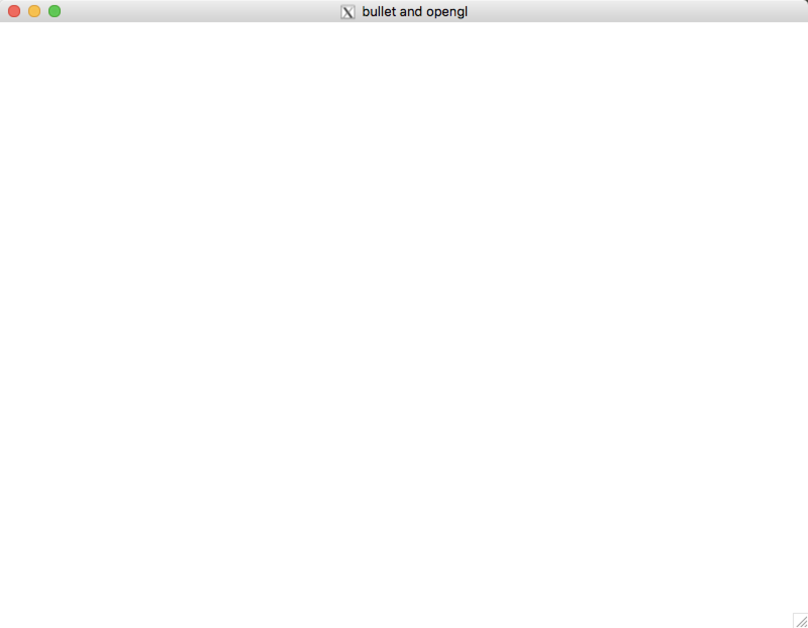
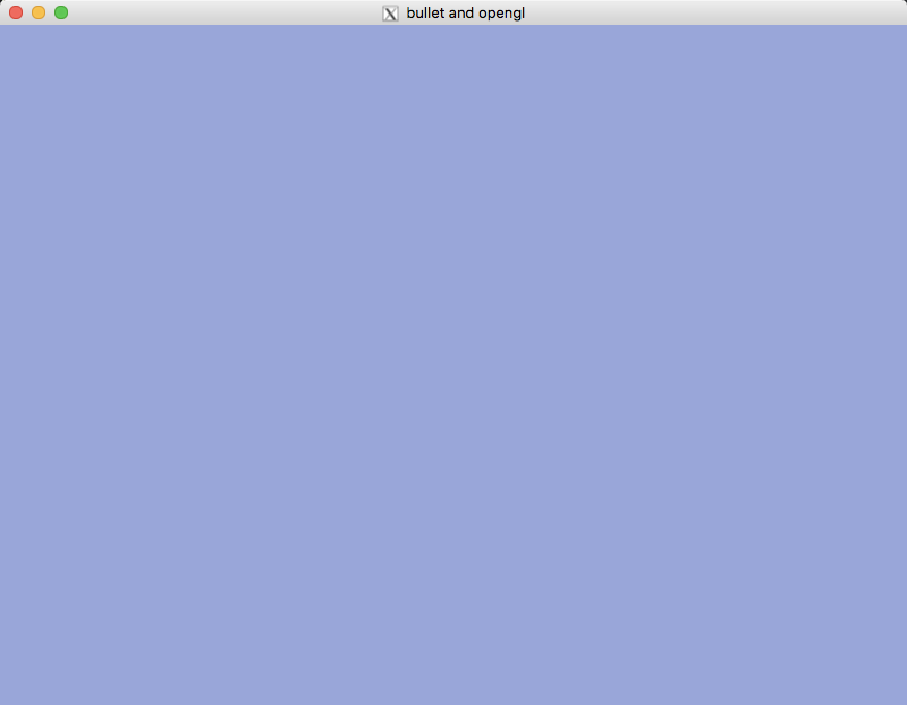
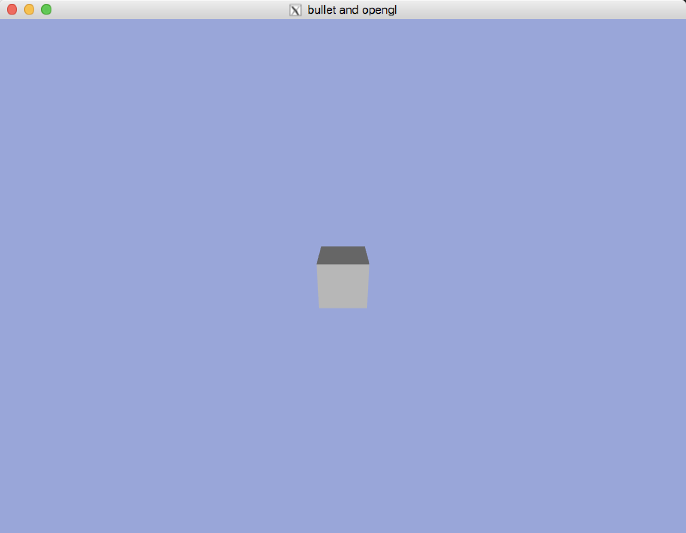
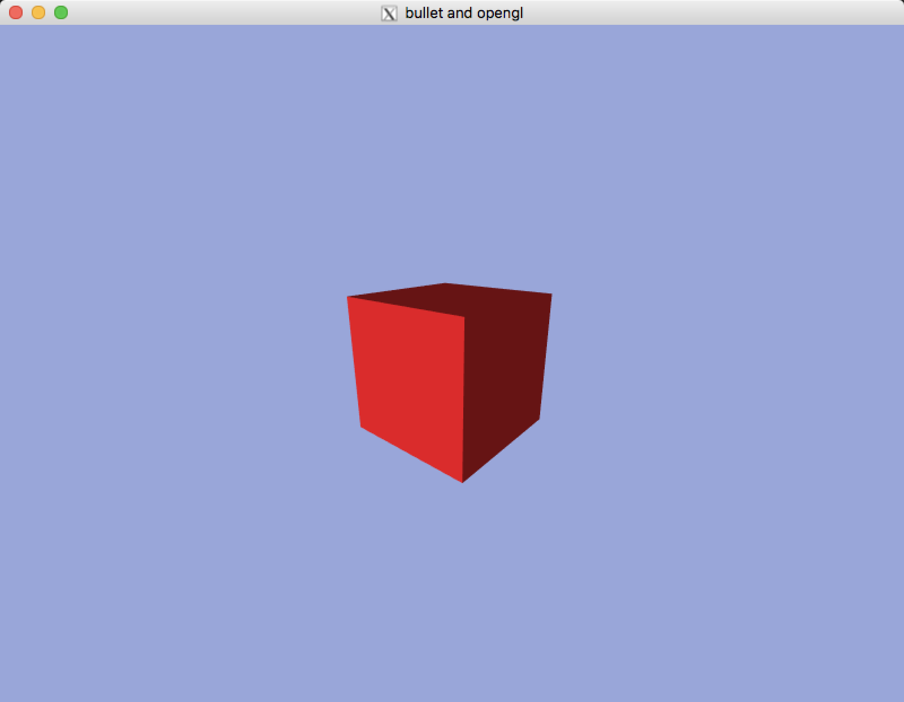

# bulletOpenGL
learning game physics with bullet physics and opengl

# Screenshots

## CH1.2 The Application Layer

## CH2.1 Rendering The Scene

## CH2.2 Basic Rendering And Lighting

## CH2.3 User Input And Camera Control

> USE `up` `down` `left` `right` to move and USE `Z` `X` to zoom 

## CH3.2 Createing Our First Physics Object

